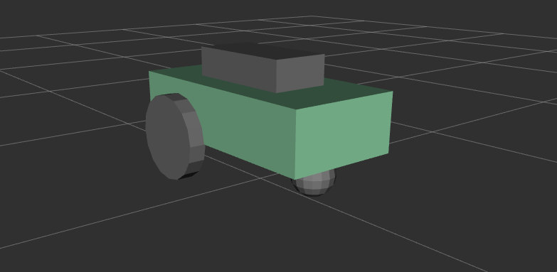
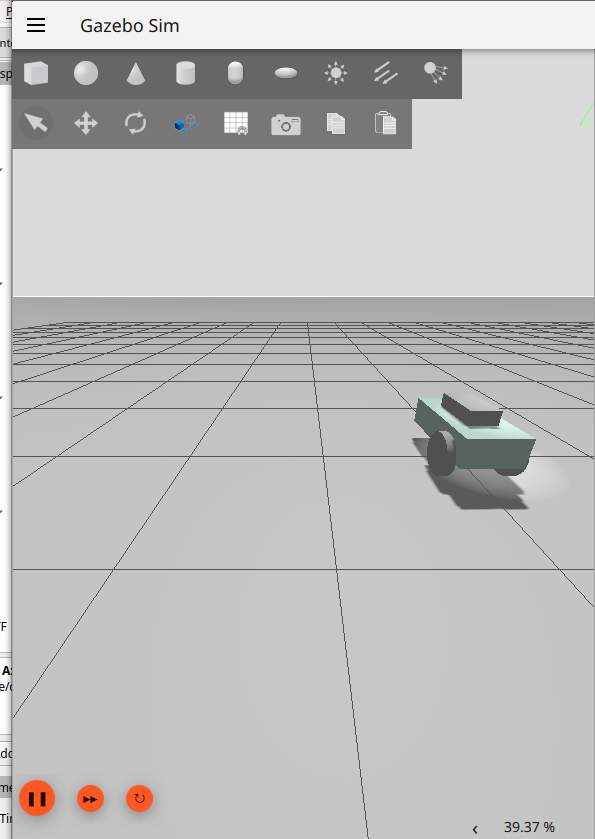

# Point-to-Point Robot Controller

## Visualization

### RViz2


### Gazebo


## About this project
This project is implemented using ROS 2 Foxy, RViz2, and Gazebo. It enables point-to-point control of a robot.

## How to run

### 1. Clone the repository 
```bash  
git clone https://github.com/Imotechs/point-to-point-controller.git 

2. cd point-to-point-controller  
3. colcon build  

4. Launch Gazebo and RViz to spawn the robot in the environment

ros2 launch controller_bringup gazebo.launch.xml  

5. Move the robot
ros2 run robot_controller move_robot  

6. command:
docker build -t r2_jazzy .
docker run -it --rm --env DISPLAY=host.docker.internal:0 --name ros2_container -v "C:\Users\USER\Desktop\ROS_PROJECT\thesis:/ros_ws" r2_jazzy

7. Watch the robot move...

'''
